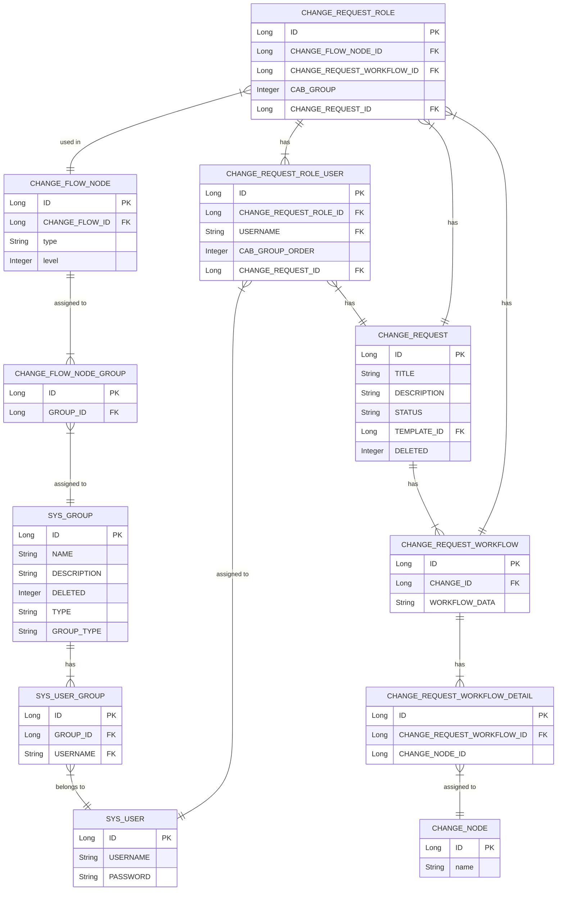

```mermaid
erDiagram
    SYS_USER {
        Long ID PK
        String USERNAME
        String PASSWORD
    }
    SYS_GROUP ||--|{ SYS_USER_GROUP: "has"
    SYS_GROUP {
        Long ID PK
        String NAME
        String DESCRIPTION
        Integer DELETED
        String TYPE
        String GROUP_TYPE
    }

    CHANGE_REQUEST ||--|{ CHANGE_REQUEST_WORKFLOW: "has"
    CHANGE_REQUEST {
        Long ID PK
        String TITLE
        String DESCRIPTION
        String STATUS
        Long TEMPLATE_ID FK
        Integer DELETED
    }

    SYS_USER_GROUP }|--|| SYS_USER: "belongs to"
    SYS_USER_GROUP {
        Long ID PK
        Long GROUP_ID FK
        String USERNAME FK
    }

    CHANGE_REQUEST_WORKFLOW ||--|{ CHANGE_REQUEST_WORKFLOW_DETAIL: "has"
    CHANGE_REQUEST_WORKFLOW {
        Long ID PK
        Long CHANGE_ID FK
        String WORKFLOW_DATA
    }

    CHANGE_REQUEST_ROLE }|--|| CHANGE_FLOW_NODE: "used in"
    CHANGE_REQUEST_ROLE ||--|{ CHANGE_REQUEST_ROLE_USER: "has"
    CHANGE_REQUEST_ROLE }|--|| CHANGE_REQUEST: "has"
    CHANGE_REQUEST_ROLE }|--|| CHANGE_REQUEST_WORKFLOW: "has"
    CHANGE_REQUEST_ROLE {
        Long ID PK
        Long CHANGE_FLOW_NODE_ID FK
        Long CHANGE_REQUEST_WORKFLOW_ID FK
        Integer CAB_GROUP
        Long CHANGE_REQUEST_ID FK
    }
    CHANGE_REQUEST_ROLE_USER }|--|| SYS_USER: "assigned to"
    CHANGE_REQUEST_ROLE_USER }|--|| CHANGE_REQUEST: "has"
    CHANGE_REQUEST_ROLE_USER {
        Long ID PK
        Long CHANGE_REQUEST_ROLE_ID FK
        String USERNAME FK
        Integer CAB_GROUP_ORDER
        Long CHANGE_REQUEST_ID FK
    }
    CHANGE_REQUEST_WORKFLOW_DETAIL }|--|| CHANGE_NODE: "assigned to"
    CHANGE_REQUEST_WORKFLOW_DETAIL {
        Long ID PK
        Long CHANGE_REQUEST_WORKFLOW_ID FK
        Long CHANGE_NODE_ID
    }

    CHANGE_NODE {
        Long ID PK
        String name
    }
    CHANGE_FLOW_NODE_GROUP }|--|| SYS_GROUP: "assigned to"
    CHANGE_FLOW_NODE ||--|{ CHANGE_FLOW_NODE_GROUP: "assigned to"
    CHANGE_FLOW_NODE_GROUP {
        Long ID PK
        Long GROUP_ID FK
    }

    CHANGE_FLOW_NODE {
        Long ID PK
        Long CHANGE_FLOW_ID FK
        String type
        Integer level
    }
```
